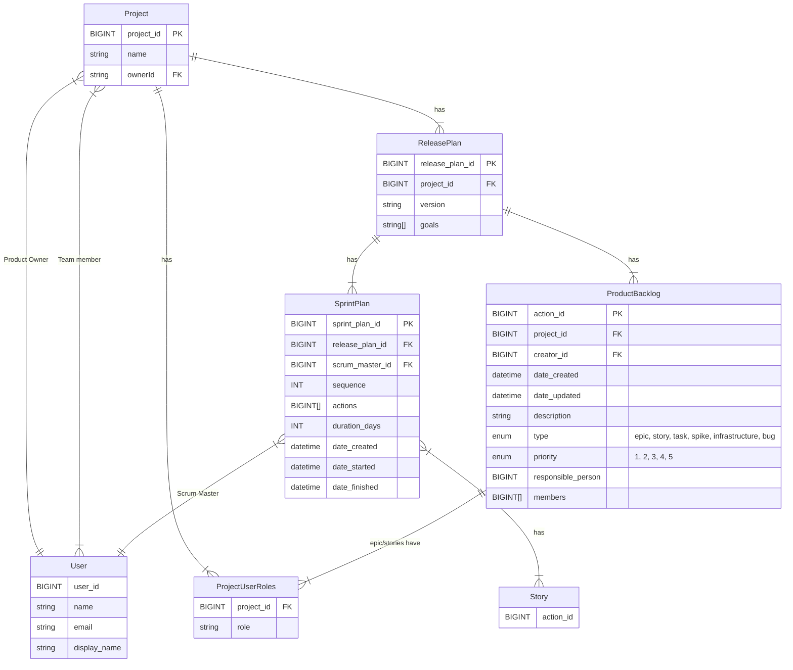

# Data Model

```mermaid

erDiagram

    User {
        BIGINT user_id
        string name
        string email
        string display_name

    }

    Project {
        BIGINT project_id PK
        string name
        string ownerId FK
    }

    ProjectUserRoles {
        BIGINT project_id FK
        string role
    }

    ReleasePlan {
        BIGINT release_plan_id PK
        BIGINT project_id FK

        string version 
        string[] goals

    }

    SprintPlan {
        BIGINT sprint_plan_id PK
        BIGINT release_plan_id FK
        BIGINT scrum_master_id FK

        INT sequence
        BIGINT[] actions
        
        INT duration_days
        datetime date_created
        datetime date_started
        datetime date_finished
    }

    ProductBacklog {
        BIGINT action_id PK
        BIGINT project_id FK
        BIGINT creator_id FK

        datetime date_created
        datetime date_updated

        string description
        enum type "epic, story, task, spike, infrastructure, bug"
        enum priority "1, 2, 3, 4, 5"

        BIGINT responsible_person
        BIGINT[] members
    }

    Story {
        BIGINT action_id
    }


    Project }|--|| User: "Product Owner"
    Project }|--|{ User: "Team member"
    Project ||--|{ ProjectUserRoles: has

    Project ||--|{ ReleasePlan: has
    ReleasePlan ||--|{ SprintPlan: has
    ReleasePlan ||--|{ ProductBacklog: has

    SprintPlan }|--|{ Story: has
    SprintPlan }|--|| User: "Scrum Master"

    
    ProductBacklog ||--|{ ProjectUserRoles: "epic/stories have"


```